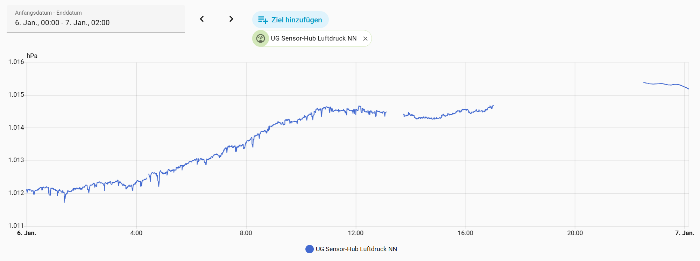
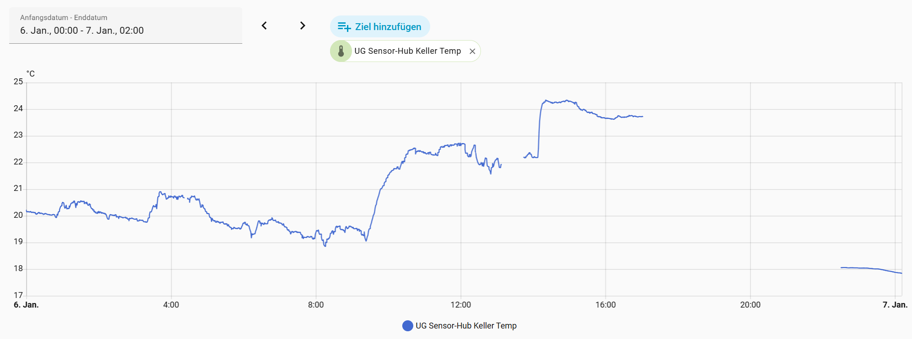
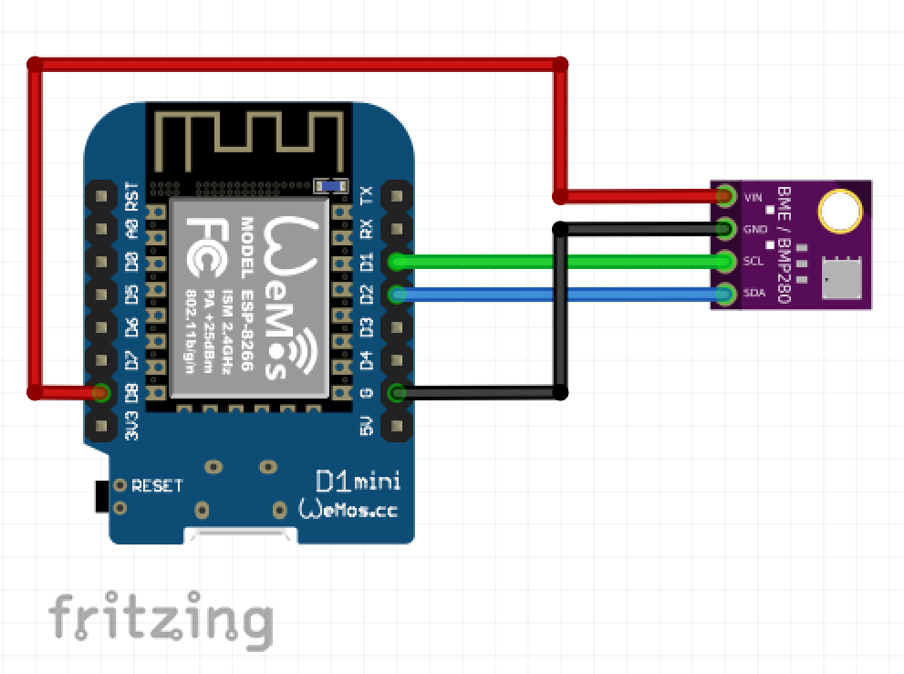

# ESPHome bme280_i2c_wrapper

ESPHome includes a BME280 component based on the Adafruit BME280 source. I had issues with high noise and spikes of measurements even when oversampling is set to 16x.
When the sensor is powered all the time the temerature may read out to high. This more expensive sensor can perform much better!

The data sheet of the BME280 strongly recommends to use the original driver from Bosch. For exampe, the compensation parameters should be read in burst. Therfore I gave the origimal driver a try. Refer to: . The original source code is somewhat old fashioned C language, but ESPHome/platform.io compiles it with no issues.

This BME280I2CWrapper class is just a C++ wrapper component for the original Bosch Sensortec Api code which ist included as library. It uses the I2C interface.
This repository complies to the ESPHome structural recomendations, but is was created from previously existing code. Therefore it does not match the ESPHome coding style.

The BME280 needs a 3.3V supply voltage. It can be driven via an 3.3V or GPIO output pin of the ESP8266. In the example configuration yaml D8 is used.
When a GPIO pin is specified within the configuration the sensor will be powered during setup and measurements only.

Using this component the measuring results are much smoother. Refer to the folowing images for pressure and temperature graphs. At the beginning ESPHome bme20_i2c platform is used at 16x oversampling. After the pause this component is used with the same parameters. The noise is gone and te temperature reads out at a correct level.

Here is a simple wiring diagram using an ESP8266 WeMos D1 mini:

